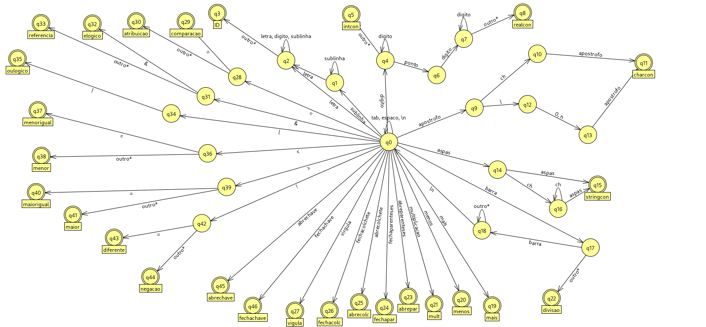

- [X] Lexer
- [ ] Parser
- [ ] Analise Semantica

# uso

- Compilar com:

`./build.sh`

- ou:

`gcc -g ./lexer/*.c ./main.c -o croc`

- Executar com:

`./croc <codigo>`

- Executar com arquivo exemplo:

`./croc ./doc/examples/code.proc`

- Em um so comando:

`gcc -g ./lexer/*.c ./main.c -o croc && ./croc ./doc/examples/code.proc`

- Teste:

`gcc -g ./lexer/*.c ./test.c -o croc && ./croc`

# problemas

- [ ] Output colorido em testes
- [ ] Todo ID deve ser checado pelo parser se é reservado?
- [ ] Refactor indispensável no parser: remover erros que não serão usados
- [ ] Refatorar testes: setup e teardown
- [ ] Remover enums erros desnecessarias do parser
- [ ] Objeto parser com seu proprio estado (token, file, line)
- [ ] Contador de linha esta funcionando no analisador sintatico?
- [ ] Parser testes unitarios + integracao
- [ ] Adicionar especificacao da linguagem `proc` e manter atualizada
- [ ] Refactor: remover transition.h e transition.c
- [ ] Refactor: organizar melhor as enums...
- [X] Setup GitHub Actions para testes
- [X] automato nao funciona
- [X] funciona corretamente
    - [X] id
    - [X] intcon
    - [X] realcon
    - [X] charcon
    - [X] stringcon
    - [X] sinais
    - [X] comentario
- [X] \n processado corretamente
- [X] \n, \0 nao e reconhecido como charcon independente: tem que refazer o automato 😰
- [X] sem tratamento de erro: tokens malformados
- [X] nao retorna palavras reservadas
- [ ] nao lida com lexemas maiores que o tamanho limite
- [X] mudar valor false de outro para enum para maior legibilidade
- [X] contador de linha: retornado pelo erro com sucesso
- [X] refatorar codigo de print de tag token (sinal)
- [ ] imprimir charcon corretamente?
- [X] refatorar tratamento de erros?
- [X] refatorar codigo palavras reservadas
- [ ] melhorar logica categorias de transicao: precisa de um campo especifico pra outro?

